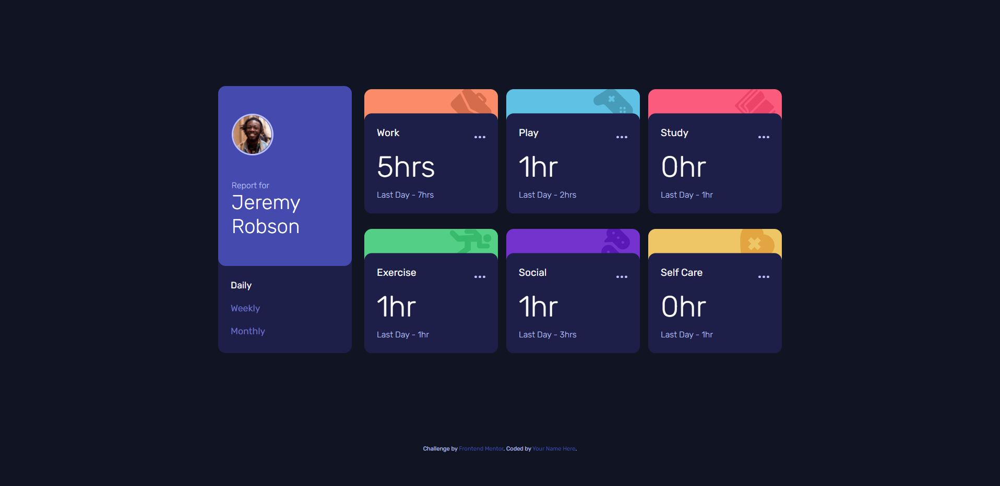

# Frontend Mentor - Time tracking dashboard solution

This is a solution to the [Time tracking dashboard challenge on Frontend Mentor](https://www.frontendmentor.io/challenges/time-tracking-dashboard-UIQ7167Jw). Frontend Mentor challenges help you improve your coding skills by building realistic projects. 

## Table of contents

- [Overview](#overview)
  - [The challenge](#the-challenge)
  - [Screenshot](#screenshot)
  - [Links](#links)
- [My process](#my-process)
  - [Built with](#built-with)
  - [What I learned](#what-i-learned)
  - [Continued development](#continued-development)
- [Author](#author)

## Overview

### The challenge

Users should be able to:

- View the optimal layout for the site depending on their device's screen size
- See hover states for all interactive elements on the page
- Switch between viewing Daily, Weekly, and Monthly stats

### Screenshot

### Links

- Solution URL: [https://www.frontendmentor.io](https://www.frontendmentor.io/solutions/responsive-dashboard-with-bem-flex-and-grid-SkeDymtQc)
- Live Site URL: [https://larkl.github.io/fm-time-tracking/](https://larkl.github.io/fm-time-tracking/)

## My process

### Built with

- Semantic HTML5 markup
- CSS custom properties
- Flexbox
- CSS Grid
- Mobile-first workflow
- Javascript event and element creation

### What I learned

* Practiced Javascript element creation and decided to update values when selecting frequnecy instead of create and delete elements each time. To check the effects of the tasks, I created a mock version in html for the first task to try possible structure of that component and its styling.

* I also practiced Grid layouts areas with responsiveness.

### Continued development

## Author

- Website - [lArkl](https://github.com/lArkl)
- Frontend Mentor - [@lArkl](https://www.frontendmentor.io/profile/lArkl)
